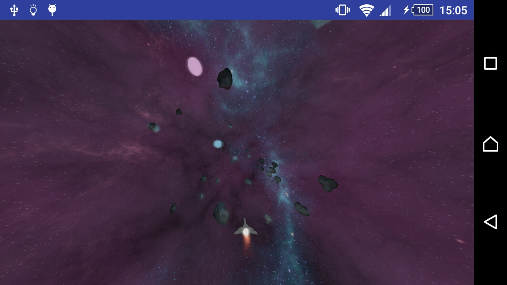

**An interactive game, build using OpenGL es 3.0 for Android**

* Install by [building and launching](https://developer.android.com/studio/run/index.html) the project from android studio on a phone that supports OpenGL es 3.0.
* A report on the project is available [here](interactive-graphics-application .pdf).
* Gameplay footage of the game can be found [here](gameplay.avi).
